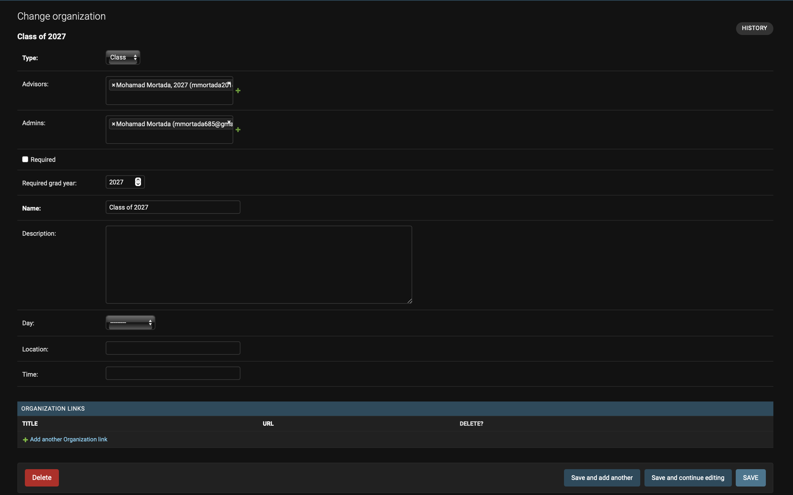

# Admin Panel Instruction Manual

Welcome to the Fremont App Admin Panel Instruction Manual! This guide provides a comprehensive overview of the app's features and instructions for club officers, advisors, ASB members, and staff. However, anyone interested is welcome to read it!

To access the table of contents, click the list button in the top left corner.

For any questions, please reach out to:

- **Mohamad Mortada, Lead App Developer and Creator**
  - Email: [mmortada685@gmail.com](mailto:mmortada685@gmail.com)
  - Instagram: [__mohamad_mortada__](https://www.instagram.com/__mohamad_mortada__/)
  - Discord: thedev132

## Accessing the Admin Panel

The _Admin Panel_ is a website where club officers, advisors, ASB members, and staff can manage various features of the app.

To access the admin panel, visit [https://fremont-app-backend.vercel.app/admin/](https://tinyurl.com/fremont-app). Sign in using your FUHSD Google Account by clicking the _Sign in with Google_ button. While anyone can sign in, you must be added as an admin to at least one _Organization_ (such as ASB, graduating classes, or clubs) to perform any administrative actions.

If you have logged into the app before, you are likely already an admin for any clubs where you are an officer. If not, please contact us (see contact information above) so we can grant you access.

## Managing Organizations

You can manage general information about your Organizations on the [_Organizations_](https://fremont-app-backend.vercel.app/admin/core/organization/) tab.

Editable fields include:

- **Advisors/Admins:** Only advisors can edit other advisors, while both advisors and admins can edit admins. To add someone, start typing their name; autocomplete should help. If a user isn't found, they haven't logged into the app yet.
- **Name:** The name of the organization as displayed throughout the app. Please keep changes minimal.
- **Description:** This text block is displayed in the clubs tab of the app. It's recommended to provide a basic description of your organization.
- **Day:** (_Applicable only to clubs_) The regular meeting day, displayed on the app's club page.
- **Time:** (_Applicable only to clubs_) The regular meeting time, displayed on the app's club page.
- **Location:** (_Applicable only to clubs_) The regular meeting location, displayed on the app's club page.

## Posting Announcements

To post an announcement, navigate to the _Posts_ tab and click the add button.

Provide the details for the announcement, including:

- **Organization:** The organization associated with the announcement.
- **Title:** The title that will appear in the _News_ tab of the app.
- **Content:** The main content of the announcement, displayed in the detailed view.
- **Published:** Check this box to publish the announcement.

## Self Hosting

### Step  1: Clone the code
git clone https://thedev132/fremont-app

### Step 2: Install required dependencies
npm install 

### Step 3: Install proper software 

For iOS development:
Install Xcode on MacOS

For Android Development:
Install Android Studio

### Step 4: Prebuild

Run npx expo prebuild

### Step 5: Run!

For iOS: npx expo run:ios
For Android: npx expo run:android

#### Step 6: Enjoy!
